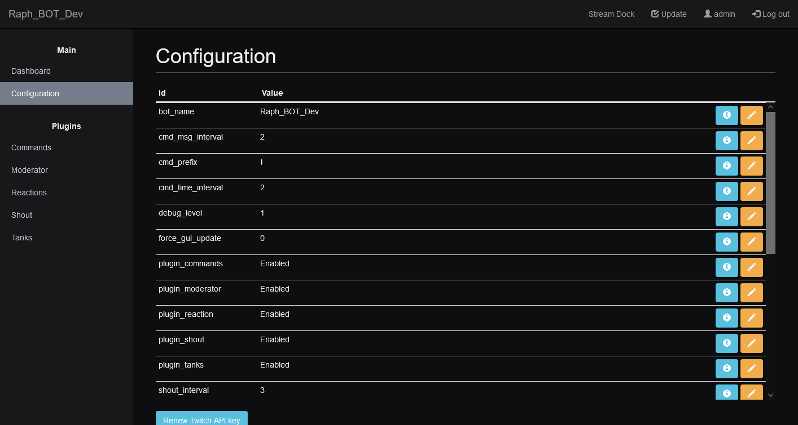
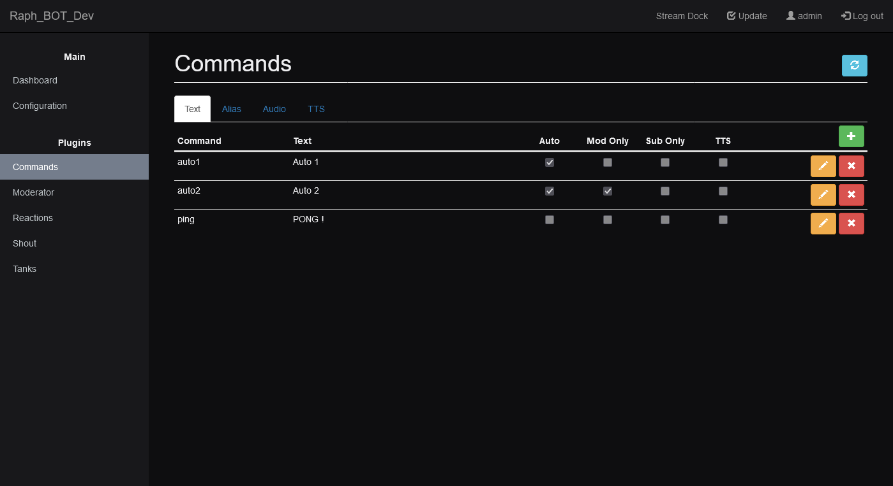
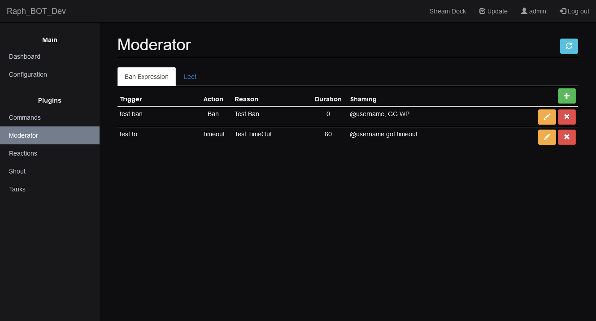
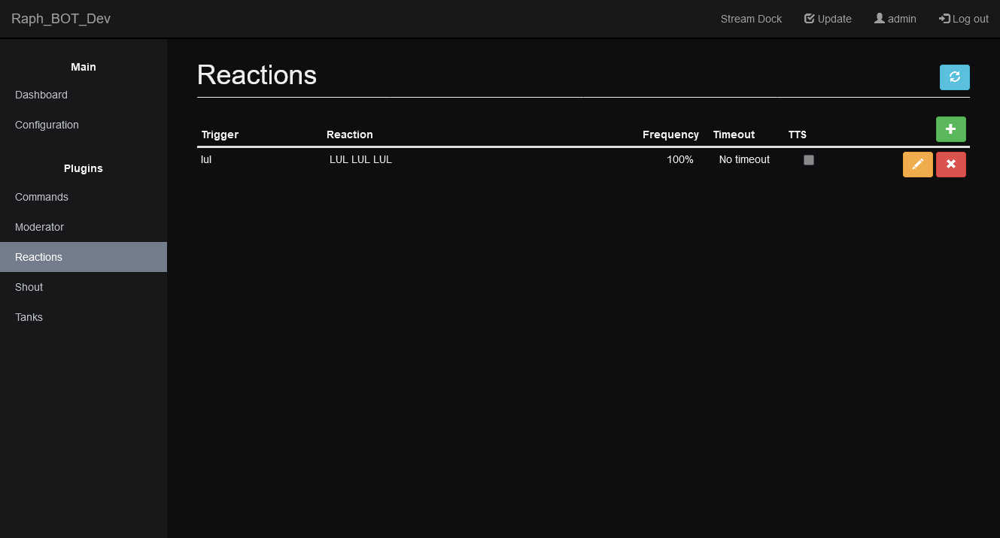
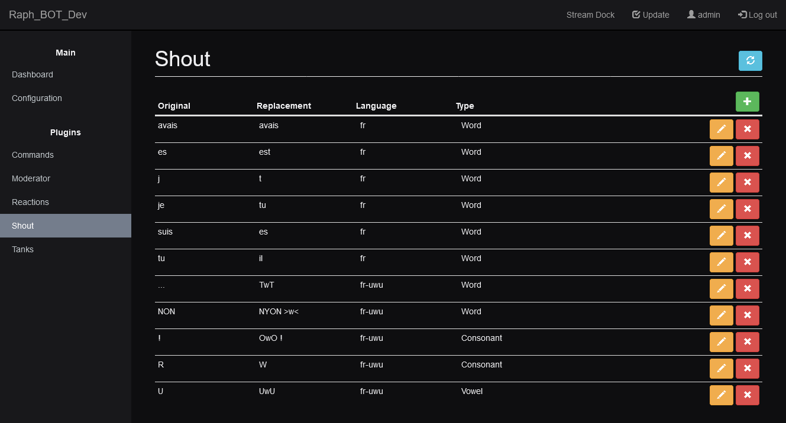

# Configuration

Global configuration page

### Screenshot

# Commands

Commands provide an easy way to give information to viewer in chat.
You can set as many commands as you want, with as many aliases as you need. It's not uncommon to have many aliases for one command.

Raph_BOT support two type of commands : Text and Audio.
Text commands can be pure text (the text is send directly to chat) or TTS (text is converted by a TTS Engine then played by the dashboard).

Audio commands can be any .mp3 files, they are store in the server Raph_BOT is running on. Audio commands are played through the dashbord.

For both TTS and audio commands, add the player (***[SERVER_URL]**/player.html*) as Navigator source to OBS.

### Global Configuration :
- cmd_prefix : Prefix before every commands (by default '!')
- cmd_msg_interval : Number of message send in chat before an auto command is send
- cmd_time_interval : Time before an auto command is send

### Screenshot

# Moderator

The moderator can help you moderating people in chat.

You can set word or expression that will trigger ban / timeout / message deletion.

There is a built-in "L33T Speak" dictionnary to avoid people bypassing the moderator. Every message are unleet before checking if any word or expression are trigger.

### Screenshot

# Reaction

Reaction provide a fun way to interact with the chat.

You set keyword that will trigger reaction send to chat, keyword can be duplicated to add variaty. If there is duplicate, the API will choose randomly one.

Frequency and timeout setting will help you make reaction less common or repetitive but they can be set to 0.

TTS can be enable on reaction, the dashboard need to be open and unmute.

### Screenshot

# Shout

Shout is an event happening one every x messages, x should be high.

Shout use a dictionnary to help it change the pronoun and verb, 'I' become 'YOU' and 'YOU' become 'HE/SHE' for exemple.

### Exemple :
- Original message : "you are really funny !"
- Shout : "OH WOW, HE IS REALLY FUNNY !"

### Global Configuration :
- shout_interval : How often shout should happen (can vary if the message is too short or too long).
- shout_language : 'fr' and 'fr-uwu'

### Screenshot

