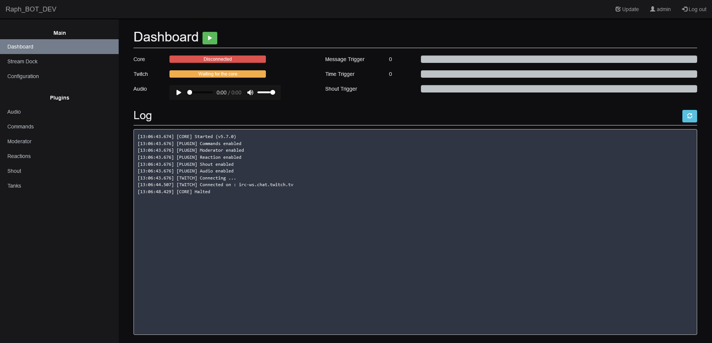

# Raph_BOT

Raph_BOT is a twitch chat bot.

# Prerequisite : 

Linux package :
- Apache2 (with mod_rewrite)
- PHP 7.0 (or higher)
- MariaDB (MySQL)
- NodeJS (v16)

NodeJS module: 
- socket.io : ^4.6.1
- tmi.js : 1.8.5
- node-fetch : ^3.3.1,
- gtts : ^0.2.1

# First time setup

### Automated install

If you don't have any linux package installed, you can use "1_Install_server.sh" to install them.

To perform the install you will need the following information :
- The database config (host, user, password, database)
- The URL of the Raph_BOT API (Exemple : "http(s)://SERVERNAME/api/")
- If you use HTTPS, the path to the key and certificate of the Apache virtual host

Then run "2_Install_app.sh" script with sudo.

### Backend
- Use raph_bot_struct.sql and raph_bot_data.sql to configure your database with the required tables

### Create auth token
- Log into RaphBOT WebUI (default user is 'admin' with password '0'), ignore all errors related to "API ERROR". You don't have any pair of client/token yet.
- Go to "Authentication". 
- Add two client, set usage to 'Core' for one and 'WebUI' for the other. 
- Use the renew button on both client to generate a token. Config files are automatically edited.
- Relog into the WebUI for the change to be effective.

### Configure bot
- Log into the dashboard
- Go to https://dev.twitch.tv/console/apps/create and register the Bot with the following :
    - URL : http(s)://<SERVER_IP>/config.php 
    - Category : Chat Bot
- Copy the client ID, paste it in the config key "twitch_client_id", save
- Click on the "Renew Twitch Token" button at the bottom of the page
- You may need to change "twitch_scope" parameter for some feature, but default should work. (Doc : https://dev.twitch.tv/docs/authentication/scopes/)
- Set the other configuration key if needed
- Most modules have their own configuration tab, check those too

# Documentation

- [API Documentation](.documentation/api/readme.md)
- [Feature Documentation](.documentation/feature/readme.md)

# DISCLAIMER

THE SOFTWARE IS PROVIDED "AS IS", WITHOUT WARRANTY OF ANY KIND, EXPRESS OR IMPLIED, INCLUDING BUT NOT LIMITED TO THE WARRANTIES OF MERCHANTABILITY, FITNESS FOR A PARTICULAR PURPOSE AND NONINFRINGEMENT. IN NO EVENT SHALL THE AUTHORS OR COPYRIGHT HOLDERS BE LIABLE FOR ANY CLAIM, DAMAGES OR OTHER LIABILITY, WHETHER IN AN ACTION OF CONTRACT, TORT OR OTHERWISE, ARISING FROM, OUT OF OR IN CONNECTION WITH THE SOFTWARE OR THE USE OR OTHER DEALINGS IN THE SOFTWARE.
