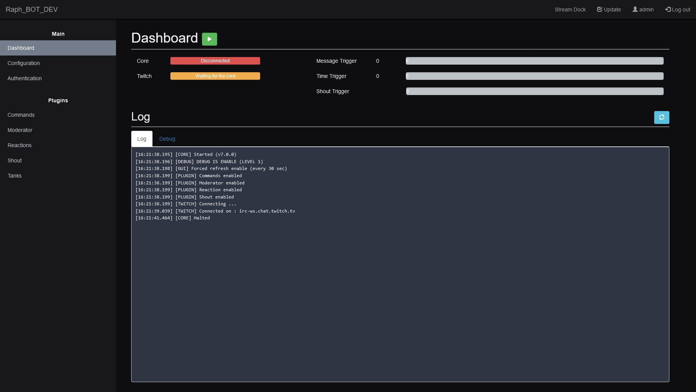

# Raph_BOT

Raph_BOT is a twitch chat bot.

# Prerequisite : 

Linux package :
- Apache2 (or any web server)
- PHP 7.0 (or higher)
- MySQL / MariaDB
- NodeJS (v16)

NodeJS module: 
- socket.io : ^4.6.1
- tmi.js : 1.8.5
- node-fetch : ^3.3.1,
- gtts : ^0.2.1

# First time setup

- Use "first_time_setup.sh" script in the template folder.

### Backend
- Configure your web server so it uses the 'www' folder as document root. The virtual host must be HTTPS.
- Use raphbot_struct.sql and raphbot_data.sql to configure your database with the required tables
- Make sure the folder 'www/src/audio' can be written by the web server.

### WebUI
- Open "./config.json"
- Set your database config (host, user, password, database)

### Core config
- Open "./core/config.json"
- Set "API_URL" with the complete URL to access the Raph_BOT API
- Set "socket_port" (default is 3000)
- Set "socket_protocol" (http or http). Need to match the protocol of virtual host, otherwise browser will block the socket.
- Set "https_key" with the path to the Key file of the virtual host
- Set "https_cert" with the path to the Cert file of the virtual host

### Create auth token
- Log into RaphBOT WebUI (default user is 'admin' with password '0'), ignore all errors related to "API ERROR". You don't have any pair of client/token yet.
- Go to "Authentication". 
- Add two client, set usage to 'Core' for the first one and 'WebUI' for the seconds. 
- Use the renew button on both client to generate a token. Config files are automatically edited.
- Relog into the WebUI for the change to be effective.

### Configure bot
- Log into the dashboard
- Go to https://dev.twitch.tv/console/apps/create and register the Bot with the following :
    - URL : http(s)://<SERVER_IP>/config.php 
    - Category : Chat Bot
- Copy the client ID, paste it in the config key "twitch_client_id", save
- Click on the "Renew Twitch Token" button at the bottom of the page
- You may need to change "twitch_scope" parameter for some feature, but default should work. (Doc : https://dev.twitch.tv/docs/authentication/scopes/)

# Documentation

- [API Documentation](doc/api/readme.md)
- [Feature Documentation](doc/feature/readme.md)

# DISCLAIMER

THE SOFTWARE IS PROVIDED "AS IS", WITHOUT WARRANTY OF ANY KIND, EXPRESS OR IMPLIED, INCLUDING BUT NOT LIMITED TO THE WARRANTIES OF MERCHANTABILITY, FITNESS FOR A PARTICULAR PURPOSE AND NONINFRINGEMENT. IN NO EVENT SHALL THE AUTHORS OR COPYRIGHT HOLDERS BE LIABLE FOR ANY CLAIM, DAMAGES OR OTHER LIABILITY, WHETHER IN AN ACTION OF CONTRACT, TORT OR OTHERWISE, ARISING FROM, OUT OF OR IN CONNECTION WITH THE SOFTWARE OR THE USE OR OTHER DEALINGS IN THE SOFTWARE.